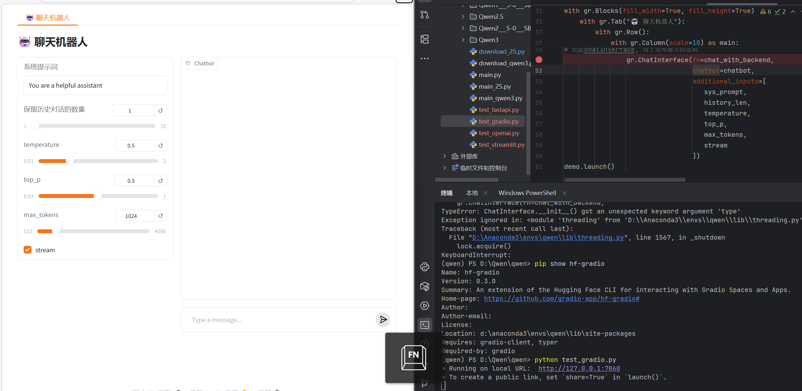
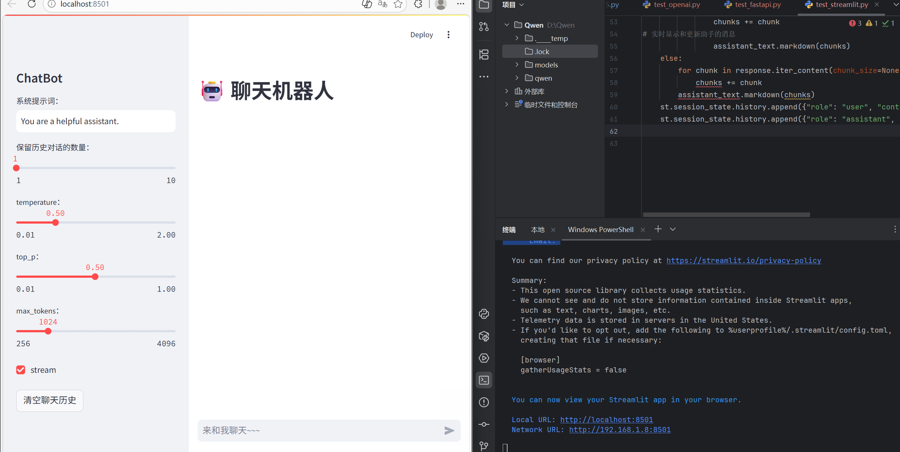
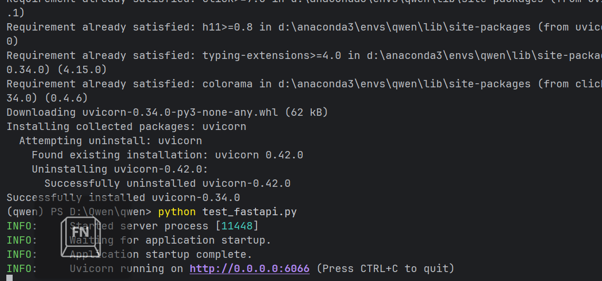
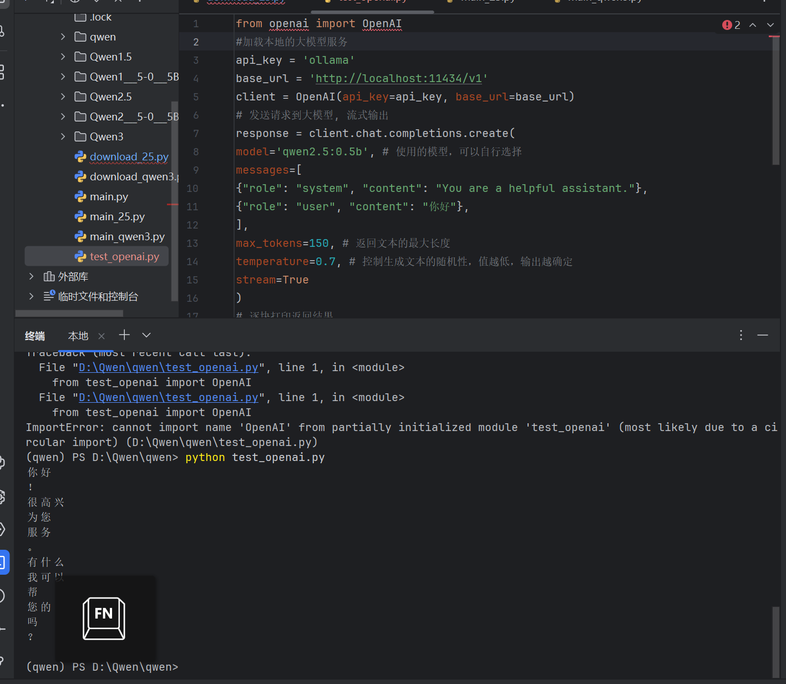
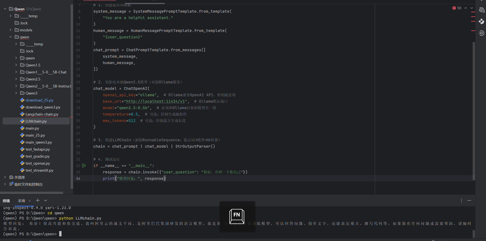
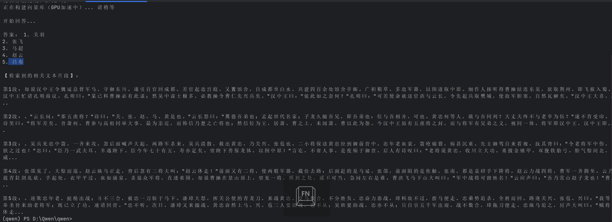
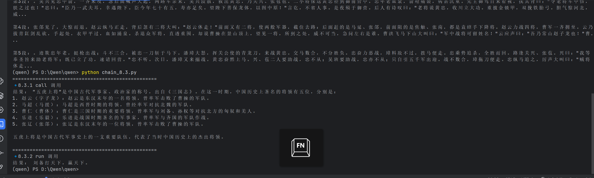
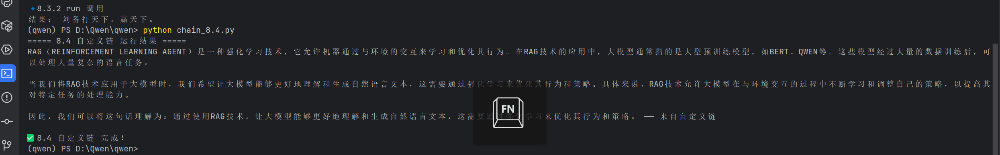

3. 模型推理

**目标**：使用`transformers`库加载Qwen2.5模型并进行基础的文本生成推理。

**核心步骤**：
- 通过`AutoTokenizer`加载与模型匹配的分词器，将对话消息转换为模型可理解的输入格式。
- 通过`AutoModelForCausalLM`加载预训练的因果语言模型，并指定运行设备（CPU或GPU）。
- 使用`apply_chat_template`方法构造符合Qwen模型要求的对话模板。
- 调用`model.generate()`生成回答，并对输出进行解码，得到最终文本。

**关键组件**：
- `AutoTokenizer`：自动选择正确的分词器，负责文本的tokenization。
- `AutoModelForCausalLM`：自动加载适合文本生成任务的预训练模型。

---

## 4. 对话机器人后端（FastAPI）

**目标**：使用FastAPI搭建一个后端服务，接收前端请求并与本地大模型（通过Ollama）交互，返回生成结果。

**主要实现**：
- 初始化FastAPI应用和异步OpenAI客户端（指向Ollama的本地服务地址`http://localhost:11434/v1`）。
- 定义`/chat`接口，接收用户输入、系统提示词、历史对话等参数。
- 根据`history_len`控制历史消息长度，构建完整的消息列表。
- 调用`AsyncOpenAI`的聊天补全接口，支持流式或非流式输出。
- 使用`StreamingResponse`实现流式响应，提升用户体验。

**特点**：
- 支持动态调整对话上下文长度。
- 集成了温度、top_p等采样参数的控制。

---

## 5. 对话机器人前端（Streamlit）

**目标**：使用Streamlit构建一个简单的Web聊天界面，与FastAPI后端交互，展示对话过程。

**主要实现**：
- 设置页面标题、图标和布局。
- 侧边栏提供系统提示词、历史记录轮数、温度、top_p等参数控制。
- 主区域显示聊天历史，支持用户输入消息。
- 通过`requests.post`向后端发送请求，并处理流式响应，实时更新助手的回答。
- 提供“清空聊天历史”按钮，重置对话状态。

**交互流程**：
1. 用户输入消息并发送。
2. 前端将消息及配置参数发送至FastAPI后端。
3. 后端调用模型生成回答，前端逐块接收并显示。

---

## 6. 对话机器人前端（Gradio）

**目标**：使用Gradio快速搭建一个功能相似的对话界面，与FastAPI后端对接。

**主要实现**：
- 使用`gr.Blocks`创建整体布局，包含一个标签页。
- 左侧面板放置系统提示词、历史记录长度、温度、top_p等控件。
- 右侧使用`gr.Chatbot`组件展示对话内容。
- 通过`gr.ChatInterface`封装聊天逻辑，内部调用自定义函数`chat_with_backend`与后端通信。
- 同样支持流式输出，通过`yield`逐词返回生成结果。

**特点**：
- 界面组件丰富，配置灵活。
- 与FastAPI后端无缝集成，代码结构清晰。  
结果如下：

在Langchain中，“链（” Chains）指的是⼀个概念上的组件或模块，它能够处理输⼊并产⽣输出。这个概念类似于编程
中的函数或者⼯作流中的步骤，其中每个链都可以执⾏特定的任务，如⽂本⽣成、问答、翻译等。链条的设计⽬的是
为了提供⼀种⽅式来组织和连接不同的⾃然语⾔处理（NLP）任务，使得这些任务可以以有序的⽅式相互作⽤，从⽽
构建出更加复杂的AI应⽤。
例如，可以构造⼀条简单链接受⽤⼾的输⼊经过格式化（Prompt Template）后传递给⼤模型。
8.2简单链（内置的链）  
8.2.1LLMchain  
LLMchain 是⼀个简单的链， LLMChain 由 PromptTemplate 和 语⾔模型（LLM或聊天模型） 组成。  

8.2.2 检索链 RetrievalQA，词嵌⼊Embedding  
检索链是Langchain中的⼀种特殊类型的链，主要⽤于从⼤量的⽂档数据集中检索相关信息，并且通常与向量数据库
（如Chroma、Pinecone、Faiss等）结合使⽤。
检索链可以帮助我们在处理如知识库查询、⽂档搜索等场景时，更有效地找到相关的⽂档⽚段，并且利⽤这些⽂档⽚
段来⽣成准确的回答。   
词嵌⼊是⾃然语⾔处理（NLP）领域的⼀个重要概念，指的是将⽂本中的词汇或短语映射到多维向量空间的技术。
这些向量不仅捕捉了词语的意义，还反映了词语之间的语义关系。在检索增强的上下⽂中，词嵌⼊⽤于将⽂档转换成
向量形式，以便能够进⾏⾼效的相似度⽐较。 
向量数据库存储这些向量，并且可以快速地根据新的查询向量来检索出最相似的⽂档。

8.3 链的调⽤⽅式
8.3.1 call
⼀种最直接的⽅法就是使⽤call，默认情况下call返回输⼊'user_question'和输出'text'的键值。
8.3.2 run
使⽤run⽅法会输出⼀个字符串⽽不是⼀个字典。

8.4 ⾃定义链
通过Langchain LCEL表达式可以轻松⾃定义链。例如构造⼀条简单链接受⽤⼾的输⼊并给出回答。

8.5 完成⼀个成语接⻰
